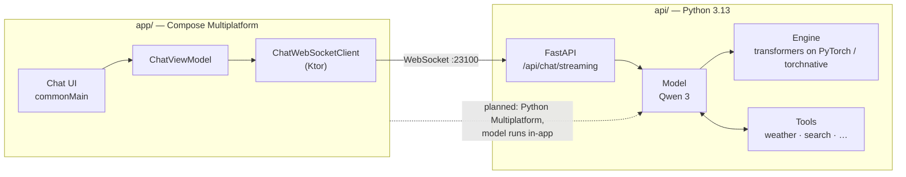

English | [한국어](docs/locale/README_ko.md)

<div align="center">


# Gemstone

**One AI chat client for every platform — built to run the model on your own device.**

[](LICENSE.md)
[](gradle/libs.versions.toml)
[](gradle/libs.versions.toml)
[](pyproject.toml)
[](#-status)

[Guide](https://logitai.github.io/Gemstone/) ·
[Quick start](#-quick-start) ·
[Architecture](#-architecture) ·
[Status](#-status)

</div>

---

## 💎 Why Gemstone?

Most AI chat apps are a thin window onto someone else's server. Gemstone starts from the other end:
**open-weight models, run where you are, behind one interface you can take to every device.**

Today that means a Kotlin [Compose Multiplatform](https://www.jetbrains.com/compose-multiplatform/)
client for Android, iOS, desktop and the web, talking to a Python server you run yourself on your
own GPU. Next, the same Python model code moves *into* the app through
[Python Multiplatform](https://github.com/thisisthepy/python-multiplatform), so chatting needs no
separate server and no network at all.

## ✨ Features

- 🧩 **One codebase, four targets** — Android, iOS, desktop (Windows, macOS, Linux) and web (Kotlin/Wasm) share the UI, view models and protocol.
- 🚀 **Streaming chat** — tokens arrive over a WebSocket as they are generated and render as Markdown on the fly.
- 🧠 **Visible reasoning** — the model's `<think>` block appears as a collapsible panel with elapsed time.
- 🔌 **Tool calling** — weather, public holidays, exchange rates, a calculator and web search, run server-side in parallel and fed back to the model.
- 📦 **Open-weight models on one engine** — Qwen 3 0.6B served by a single transformers-based engine that runs on PyTorch or on [torchnative](https://github.com/thisisthepy/torchnative). Gemstone is becoming a local Ollama replacement: concurrent requests (continuous batching), OpenAI- and Ollama-compatible APIs and 8-bit weights are planned for November 2026.
- 🖥️ **Native desktop feel** — a JetBrains Jewel decorated window, with Dmg / Msi / Deb installers.

## 🚀 Quick start

You need Git, Python 3.13, [uv](https://docs.astral.sh/uv/) and JDK 21. The default model (Qwen 3
0.6B) runs on a CPU.

**1. Clone and install the server**

```bash
git clone https://github.com/LogitAI/Gemstone.git
cd Gemstone
uv sync --extra torch          # or --extra torchnative (the two cannot be installed together)
```

**2. Start the model server** (port `23100`; the model downloads on first use)

```bash
uv run --extra torch python -m api run server
```

Open <http://127.0.0.1:23100/> for the web client the server bundles.

The server listens on `127.0.0.1` only. To serve other machines, set `GEMSTONE_HOST` (like
`OLLAMA_HOST`) and an API key: `GEMSTONE_HOST=0.0.0.0:23100 GEMSTONE_API_KEY=<key> uv run --extra torch python -m api run server`.
Clients then send `Authorization: Bearer <key>`. `GEMSTONE_ORIGINS` allows more browser origins and
`--reload` (or `GEMSTONE_DEV=1`) turns on auto-reload for development.

**Point existing clients at Gemstone** (it listens on `23100`, not Ollama's `11434` or OpenAI's HTTPS host):

```bash
OLLAMA_HOST=http://127.0.0.1:23100 ollama run qwen3          # the ollama CLI and Ollama clients
OPENAI_BASE_URL=http://127.0.0.1:23100/v1 OPENAI_API_KEY=x python my_script.py   # OpenAI SDKs
```

`qwen3`, `qwen3:latest` and `qwen3:0.6b` are the built-in model (fetched on first use); any Hugging Face
model is pulled by its id, e.g. `ollama pull Org/Model`. Other Ollama library names (`llama3.2`) are not
available. When `GEMSTONE_API_KEY` is set on the server, send it as the key: `OPENAI_API_KEY=<key>` for
OpenAI SDKs, or an `Authorization: Bearer <key>` header for other clients (if your Ollama client cannot send
a header, use it on a loopback server without a key). `think: false` (Ollama) and `reasoning_effort: "none"`
(OpenAI) switch Qwen3's reasoning off.

**3. Run a native client**

```bash
./gradlew :app:run           # desktop
./gradlew :app:installDebug  # Android
```

The server listens on `127.0.0.1` only. For an Android device or emulator, run the server on the same
machine and `adb reverse tcp:23100 tcp:23100`. To serve other machines on your LAN, start it with
`GEMSTONE_HOST=0.0.0.0` and set `GEMSTONE_API_KEY=<secret>` on both sides; desktop clients take
`--server http://<host>:23100` (or `GEMSTONE_SERVER_HOST`). See the clients guide in `docs/guide/`.

**Talk to the server from your own code** — three frames in, tokens out:

```python
import asyncio, json, urllib.request
import websockets  # already a Gemstone dependency

async def ask(prompt: str, host: str = "127.0.0.1:23100") -> None:
    req = urllib.request.Request(f"http://{host}/api/models/qwen3/sessions/", method="POST")
    session_id = json.load(urllib.request.urlopen(req))["session_id"]

    async with websockets.connect(f"ws://{host}/api/chat/streaming") as ws:
        await ws.send(json.dumps({"session_id": session_id}))  # 1. session
        await ws.send(json.dumps([]))                          # 2. history
        await ws.send(prompt)                                  # 3. prompt
        async for token in ws:
            if token == "<EOS>":
                break
            print(token, end="", flush=True)

asyncio.run(ask("What is the weather in Daejeon today?"))
```

This follows the same protocol as the browser client in
[`api/src/main/static/index.py`](api/src/main/static/index.py).

## 🧩 Architecture



| Directory | What lives there |
|---|---|
| `app/src/commonMain` | UI, view models, network protocol — shared by every target |
| `app/src/{android,ios,desktop,wasmJs}Main` | One entry point per platform |
| `app/src/cioMain` | Ktor CIO engine shared by Android, iOS and desktop |
| `api/src/main/models` | Model definitions: prompts, sampling defaults |
| `api/src/main/engine.py` | The serving engine: one transformers-based engine for every model, on PyTorch or torchnative |
| `api/src/main/utils` | Tool implementations and the tool-calling loop |

## 📍 Status

Gemstone is an early, working prototype. The honest state of each piece:

| Area | State |
|---|---|
| Streaming chat, reasoning display, tool calling | ✅ Working |
| Android, desktop and web clients | ✅ Working |
| iOS client | 🟡 Framework targets configured; the Xcode build script needs fixing |
| Model choice in the client | 🟡 Hard-coded list, not yet read from the server |
| Chat history | 🟡 In memory only |
| Settings screen | ⏳ Planned |
| On-device inference via Python Multiplatform | ⏳ Planned |
| Offline mode, cross-device sync | ⏳ Planned |
| OpenAI-compatible API | ⏳ Planned |
| Native desktop executable (GraalVM, no JVM) | ⏳ In progress |
| Automated tests | ⏳ Not yet — the first priority |

## 📖 Documentation

- **[Gemstone Guide](https://logitai.github.io/Gemstone/)** — getting started, concepts, task guides and FAQ, in English and 한국어. Source in [`docs/guide/`](docs/guide/).
- **[한국어 README](docs/locale/README_ko.md)**

## 🌐 Ecosystem

Gemstone does not depend on these yet; it is the application the [thisisthepy](https://github.com/thisisthepy)
Python-on-every-platform stack is meant to carry:

| Project | Role |
|---|---|
| [python-multiplatform](https://github.com/thisisthepy/python-multiplatform) | CPython embedded in Kotlin Multiplatform — the path to on-device inference |
| [pythonx-compose](https://github.com/thisisthepy/pythonx-compose) | Python wrapper for Compose Multiplatform |
| [toolchain](https://github.com/thisisthepy/toolchain) | Gradle build plugin and tooling for Python Multiplatform |
| [torchnative](https://github.com/thisisthepy/torchnative) | The real PyTorch ecosystem, running on device |

## 🤝 Contributing

Issues and pull requests are welcome at [LogitAI/Gemstone](https://github.com/LogitAI/Gemstone/issues).
Gemstone is developed intent-first and test-first — read
[Contributing in the guide](https://logitai.github.io/Gemstone/faq.html#contributing) before you
open a pull request.

## 🙏 Acknowledgements

[JetBrains](https://www.jetbrains.com/) for Kotlin, Compose Multiplatform and Jewel ·
[PyTorch](https://pytorch.org/) ·
[Hugging Face](https://huggingface.co/) Transformers ·
the [Qwen](https://github.com/QwenLM) model team ·
[Open-Meteo](https://open-meteo.com/) and [Nager.Date](https://date.nager.at/) for free public APIs.

## 📄 License

[MIT](LICENSE.md) © 2025 thisisthepy
