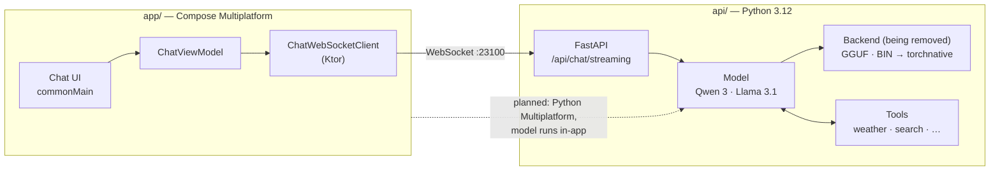

English | [한국어](docs/locale/README_ko.md)

<div align="center">


# Gemstone

**One AI chat client for every platform — built to run the model on your own device.**

[](LICENSE.md)
[](gradle/libs.versions.toml)
[](gradle/libs.versions.toml)
[](pyproject.toml)
[](#-status)

[Guide](https://logitai.github.io/Gemstone/) ·
[Quick start](#-quick-start) ·
[Architecture](#-architecture) ·
[Status](#-status)

</div>

---

## 💎 Why Gemstone?

Most AI chat apps are a thin window onto someone else's server. Gemstone starts from the other end:
**open-weight models, run where you are, behind one interface you can take to every device.**

Today that means a Kotlin [Compose Multiplatform](https://www.jetbrains.com/compose-multiplatform/)
client for Android, iOS, desktop and the web, talking to a Python server you run yourself on your
own GPU. Next, the same Python model code moves *into* the app through
[Python Multiplatform](https://github.com/thisisthepy/python-multiplatform), so chatting needs no
separate server and no network at all.

## ✨ Features

- 🧩 **One codebase, four targets** — Android, iOS, desktop (Windows, macOS, Linux) and web (Kotlin/Wasm) share the UI, view models and protocol.
- 🚀 **Streaming chat** — tokens arrive over a WebSocket as they are generated and render as Markdown on the fly.
- 🧠 **Visible reasoning** — the model's `<think>` block appears as a collapsible panel with elapsed time.
- 🔌 **Tool calling** — weather, public holidays, exchange rates, a calculator and web search, run server-side in parallel and fed back to the model.
- 📦 **Quantised open-weight models** — Qwen 3 14B and Llama 3.1 8B in 4-bit. Today they run through llama.cpp (GGUF) or transformers + bitsandbytes; those backends are being removed (transition) in favour of a single serving system built on torchnative — an Ollama replacement, with continuous batching and paged attention planned. The engine detail is a proposal, pending confirmation.
- 🖥️ **Native desktop feel** — a JetBrains Jewel decorated window, with Dmg / Msi / Deb installers.

## 🚀 Quick start

You need Git, Python 3.12, [uv](https://docs.astral.sh/uv/) and JDK 21+. A CUDA GPU is recommended
for the 14B model.

**1. Clone and install the server**

```bash
git clone https://github.com/LogitAI/Gemstone.git
cd Gemstone
uv sync
```

Optional — llama.cpp with CUDA (transitional: the llama.cpp backend is being removed):

```bash
CMAKE_ARGS="-DGGML_CUDA=on -DLLAVA_BUILD=off -DCMAKE_CUDA_ARCHITECTURES=native" \
FORCE_CMAKE=1 uv pip install llama-cpp-python --no-cache-dir --force-reinstall --upgrade
```

**2. Start the model server** (port `23100`; the model downloads on first use)

```bash
python -m api run server
```

Open <http://127.0.0.1:23100/> for the web client the server bundles.

**3. Run a native client**

```bash
./gradlew :app:run           # desktop
./gradlew :app:installDebug  # Android
```

**Talk to the server from your own code** — three frames in, tokens out:

```python
import asyncio, json, urllib.request
import websockets  # already a Gemstone dependency

async def ask(prompt: str, host: str = "127.0.0.1:23100") -> None:
    req = urllib.request.Request(f"http://{host}/api/models/qwen3/sessions/", method="POST")
    session_id = json.load(urllib.request.urlopen(req))["session_id"]

    async with websockets.connect(f"ws://{host}/api/chat/streaming") as ws:
        await ws.send(json.dumps({"session_id": session_id}))  # 1. session
        await ws.send(json.dumps([]))                          # 2. history
        await ws.send(prompt)                                  # 3. prompt
        async for token in ws:
            if token == "<EOS>":
                break
            print(token, end="", flush=True)

asyncio.run(ask("What is the weather in Daejeon today?"))
```

This follows the same protocol as the browser client in
[`api/src/test/static/index.py`](api/src/test/static/index.py).

## 🧩 Architecture



| Directory | What lives there |
|---|---|
| `app/src/commonMain` | UI, view models, network protocol — shared by every target |
| `app/src/{android,ios,desktop,wasmJs}Main` | One entry point per platform |
| `app/src/cioMain` | Ktor CIO engine shared by Android, iOS and desktop |
| `api/src/main/models` | Model definitions: prompts, sampling defaults |
| `api/src/main/backend` | Inference runtimes: llama.cpp (GGUF), transformers 4-bit (BIN) — being removed (transition) in favour of a single torchnative-based serving system |
| `api/src/main/utils` | Tool implementations and the tool-calling loop |

## 📍 Status

Gemstone is an early, working prototype. The honest state of each piece:

| Area | State |
|---|---|
| Streaming chat, reasoning display, tool calling | ✅ Working |
| Android, desktop and web clients | ✅ Working |
| iOS client | 🟡 Framework targets configured; the Xcode build script needs fixing |
| Model choice in the client | 🟡 Hard-coded list, not yet read from the server |
| Chat history | 🟡 In memory only |
| Settings screen | ⏳ Planned |
| On-device inference via Python Multiplatform | ⏳ Planned |
| Offline mode, cross-device sync | ⏳ Planned |
| OpenAI-compatible API | ⏳ Planned |
| Native desktop executable (GraalVM, no JVM) | ⏳ In progress |
| Automated tests | ⏳ Not yet — the first priority |

## 📖 Documentation

- **[Gemstone Guide](https://logitai.github.io/Gemstone/)** — getting started, concepts, task guides and FAQ, in English and 한국어. Source in [`docs/guide/`](docs/guide/).
- **[한국어 README](docs/locale/README_ko.md)**

## 🌐 Ecosystem

Gemstone does not depend on these yet; it is the application the [thisisthepy](https://github.com/thisisthepy)
Python-on-every-platform stack is meant to carry:

| Project | Role |
|---|---|
| [python-multiplatform](https://github.com/thisisthepy/python-multiplatform) | CPython embedded in Kotlin Multiplatform — the path to on-device inference |
| [pythonx-compose](https://github.com/thisisthepy/pythonx-compose) | Python wrapper for Compose Multiplatform |
| [toolchain](https://github.com/thisisthepy/toolchain) | Gradle build plugin and tooling for Python Multiplatform |
| [torchnative](https://github.com/thisisthepy/torchnative) | The real PyTorch ecosystem, running on device |

## 🤝 Contributing

Issues and pull requests are welcome at [LogitAI/Gemstone](https://github.com/LogitAI/Gemstone/issues).
Gemstone is developed intent-first and test-first — read
[Contributing in the guide](https://logitai.github.io/Gemstone/faq.html#contributing) before you
open a pull request.

## 🙏 Acknowledgements

[JetBrains](https://www.jetbrains.com/) for Kotlin, Compose Multiplatform and Jewel ·
[llama.cpp](https://github.com/ggml-org/llama.cpp) and
[llama-cpp-python](https://github.com/abetlen/llama-cpp-python) ·
[Hugging Face](https://huggingface.co/) Transformers ·
the [Qwen](https://github.com/QwenLM) and [Llama](https://www.llama.com/) model teams ·
[Open-Meteo](https://open-meteo.com/) and [Nager.Date](https://date.nager.at/) for free public APIs.

## 📄 License

[MIT](LICENSE.md) © 2025 thisisthepy
