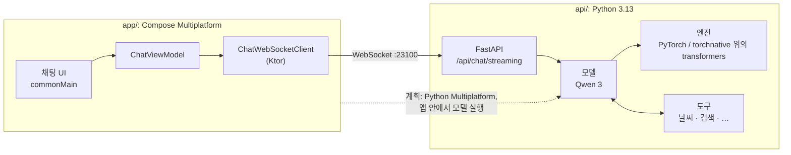

[English](https://github.com/LogitAI/Gemstone/blob/main/README.md) | 한국어

<div align="center">


# Gemstone

**모든 플랫폼에서 쓰는 하나의 AI 채팅 클라이언트입니다. 공개 가중치 모델을 내 컴퓨터에서 돌리도록 만들었습니다.**

[](https://github.com/LogitAI/Gemstone/blob/main/LICENSE.md)
[](https://github.com/LogitAI/Gemstone/blob/main/gradle/libs.versions.toml)
[](https://github.com/LogitAI/Gemstone/blob/main/gradle/libs.versions.toml)
[](https://github.com/LogitAI/Gemstone/blob/main/pyproject.toml)
[](#-현황)

[가이드](https://logitai.github.io/Gemstone/?lang=ko) ·
[시작하기](https://logitai.github.io/Gemstone/getting-started.html?lang=ko) ·
[빠른 시작](#-빠른-시작) ·
[현황](#-현황)

</div>

---

## 💎 왜 Gemstone 인가?

Gemstone 은 공개 가중치 모델을 내 컴퓨터에서 돌리고, 모든 기기에서 같은 채팅 클라이언트를 쓰게 합니다.
프롬프트는 호스팅 서비스가 아니라 내가 직접 띄운 서버로 갑니다.

지금은 Android, iOS, 데스크톱, 웹용 Kotlin
[Compose Multiplatform](https://www.jetbrains.com/compose-multiplatform/) 클라이언트와 내 컴퓨터의
Python 서버로 이루어져 있습니다. 서버의 엔진은 CPU 에서 돌고, GPU 지원은 계획입니다([#164](https://github.com/LogitAI/Gemstone/issues/164)). 다음
단계에서는 Python 모델 코드를 [Python Multiplatform](https://github.com/thisisthepy/python-multiplatform)
을 통해 앱 안으로 옮겨, 별도 서버 없이 채팅하게 합니다(계획, [#42](https://github.com/LogitAI/Gemstone/issues/42)).

## ✨ 기능

- 🧩 **하나의 코드베이스, 네 개의 타깃**: Android, iOS, 데스크톱(Windows, macOS, Linux), 웹(Kotlin/Wasm) 이 UI, 뷰모델, 프로토콜을 공유합니다.
- 🚀 **스트리밍 채팅**: 토큰이 생성되는 즉시 WebSocket 으로 도착하고, 그 자리에서 Markdown 으로 렌더링됩니다.
- 🧠 **보이는 추론 과정**: 모델의 `<think>` 블록이 경과 시간과 함께 접을 수 있는 패널로 표시됩니다.
- 🔌 **도구 호출**: 날씨, 공휴일, 환율, 계산기, 웹 검색을 서버에서 병렬로 실행하고 결과를 모델에 돌려줍니다.
- 📦 **엔진 하나로 도는 공개 가중치 모델**: Qwen 3 0.6B 를 transformers 기반 단일 엔진이 돌립니다. 이 엔진은 PyTorch 위에서도, [torchnative](https://github.com/thisisthepy/torchnative) 위에서도 돕니다.
- 🔁 **로컬 Ollama 대체제**: 동시 요청이 한 배치를 함께 씁니다(페이지드 KV 캐시를 쓰는 연속 배칭). Ollama 와 OpenAI 클라이언트는 base URL 만 바꿔 붙습니다. 4비트 가중치와 GGUF 는 계획입니다([#67](https://github.com/LogitAI/Gemstone/issues/67)).
- 🖥️ **네이티브 데스크톱 경험**: JetBrains Jewel 데코레이티드 윈도우를 쓰고, Dmg / Msi / Deb 설치 파일을 만듭니다.

## 🚀 빠른 시작

Git, Python 3.13, [uv](https://docs.astral.sh/uv/), JDK 21 이 필요합니다. 기본 모델(Qwen 3 0.6B)은
CPU 에서 돕니다.

**1. 저장소를 받고 서버 의존성 설치**

```bash
git clone https://github.com/LogitAI/Gemstone.git
cd Gemstone
uv sync --extra torch          # 또는 --extra torchnative (둘은 함께 설치할 수 없습니다)
```

**2. 모델 서버 실행** (포트 `23100`, 모델은 처음 쓸 때 내려받습니다)

```bash
uv run --extra torch python -m api run server
```

<http://127.0.0.1:23100/> 를 열면 서버에 함께 들어 있는 웹 클라이언트가 뜹니다.

서버는 `127.0.0.1` 에서만 듣습니다. 다른 기기에 열려면 `OLLAMA_HOST` 처럼 `GEMSTONE_HOST` 와 API 키를 설정하세요:
`GEMSTONE_HOST=0.0.0.0:23100 GEMSTONE_API_KEY=<key> uv run --extra torch python -m api run server`.
클라이언트는 `Authorization: Bearer <key>` 를 보냅니다. `GEMSTONE_ORIGINS` 는 브라우저 origin 을 더 허용하고,
`--reload` (또는 `GEMSTONE_DEV=1`) 는 개발용 자동 재시작을 켭니다.

**기존 클라이언트를 Gemstone 에 연결하기** (포트는 Ollama 의 `11434` 가 아니라 `23100` 입니다):

```bash
OLLAMA_HOST=http://127.0.0.1:23100 ollama run qwen3          # ollama CLI 와 Ollama 클라이언트
OPENAI_BASE_URL=http://127.0.0.1:23100/v1 OPENAI_API_KEY=x python my_script.py   # OpenAI SDK
```

`qwen3`, `qwen3:latest`, `qwen3:0.6b` 는 기본 제공 모델이며 처음 쓸 때 내려받습니다. Hugging Face 모델은 id 로
받습니다(`ollama pull Org/Model`). 그 밖의 Ollama 라이브러리 이름(`llama3.2`)은 쓸 수 없습니다. 서버에
`GEMSTONE_API_KEY` 를 설정했다면 그 값을 키로 보내세요. OpenAI SDK 는 `OPENAI_API_KEY=<key>`, 다른 클라이언트는
`Authorization: Bearer <key>` 헤더입니다(헤더를 보낼 수 없는 Ollama 클라이언트는 키 없는 loopback 서버에서 쓰세요).
`think: false`(Ollama), `reasoning_effort: "none"`(OpenAI)은 Qwen3 의 추론을 끕니다.

**3. 네이티브 클라이언트 실행**

```bash
./gradlew :app:run           # 데스크톱
./gradlew :app:installDebug  # Android
```

서버는 `127.0.0.1` 에서만 받습니다. Android 기기나 에뮬레이터에서는 서버를 같은 컴퓨터에서 실행하고
`adb reverse tcp:23100 tcp:23100` 을 쓰세요. 같은 LAN 의 다른 기기에 서비스하려면 서버를
`GEMSTONE_HOST=0.0.0.0` 으로 시작하고 양쪽에 `GEMSTONE_API_KEY=<비밀값>` 을 설정합니다. 데스크톱
클라이언트는 `--server http://<호스트>:23100` (또는 `GEMSTONE_SERVER_HOST`)을 받습니다.
자세한 내용은 [클라이언트 가이드](https://logitai.github.io/Gemstone/guide-clients.html?lang=ko) 를 보세요.

**내 코드에서 서버와 대화하기**: 프레임 세 개를 보내면 토큰이 흘러나옵니다:

```python
import asyncio, json, urllib.request
import websockets  # Gemstone 의존성에 이미 포함

async def ask(prompt: str, host: str = "127.0.0.1:23100") -> None:
    req = urllib.request.Request(f"http://{host}/api/models/qwen3/sessions/", method="POST")
    session_id = json.load(urllib.request.urlopen(req))["session_id"]

    async with websockets.connect(f"ws://{host}/api/chat/streaming") as ws:
        await ws.send(json.dumps({"session_id": session_id}))  # 1. 세션
        await ws.send(json.dumps([]))                          # 2. 대화 기록
        await ws.send(prompt)                                  # 3. 프롬프트
        async for token in ws:
            if token == "<EOS>":
                break
            print(token, end="", flush=True)

asyncio.run(ask("오늘 대전 날씨가 어때?"))
```

브라우저 클라이언트 [`api/src/main/static/index.py`](https://github.com/LogitAI/Gemstone/blob/main/api/src/main/static/index.py) 와 같은
프로토콜입니다.

## 🧩 아키텍처



| 디렉터리 | 들어 있는 것 |
|---|---|
| `app/src/commonMain` | UI, 뷰모델, 네트워크 프로토콜: 모든 타깃이 공유 |
| `app/src/{android,ios,desktop,wasmJs}Main` | 플랫폼별 진입점 하나씩 |
| `app/src/cioMain` | Android, iOS, 데스크톱이 공유하는 Ktor CIO 엔진 |
| `api/src/main/models` | 모델 정의: 프롬프트, 샘플링 기본값 |
| `api/src/main/engine.py` | 서빙 엔진: 모든 모델을 맡는 transformers 기반 엔진 하나. PyTorch 또는 torchnative 위에서 돈다 |
| `api/src/main/utils` | 도구 구현과 도구 호출 루프 |

## 📍 현황

Gemstone 은 초기 단계의, 동작하는 프로토타입입니다. 각 행에 상태를 적고, 남은 일이 있으면 그 일을
추적하는 이슈를 붙였습니다. Python 테스트(실제 모델 포함)와 Kotlin 네트워크 계층 테스트가 CI 에서 돕니다.

| 영역 | 상태 |
|---|---|
| 스트리밍 채팅, 추론 표시, 도구 호출 | ✅ 구현 |
| transformers 단일 엔진, 연속 배칭, 페이지드 KV 캐시 (CPU) | ✅ PyTorch 에서 구현, 🟡 torchnative 에서는 부분: CPU 는 배칭을 빼고 통과, mps 는 torchnative 대기 ([#84](https://github.com/LogitAI/Gemstone/issues/84)) |
| 여러 모델 상주, 축출, `keep_alive` | ✅ 구현 |
| OpenAI 호환 API (`/v1`, 도구 호출은 클라이언트로 전달) | 🟡 부분: `n` > 1, logprobs, embeddings 없음 |
| Ollama 호환 API (chat, generate, tags, show, pull, delete, ps, copy, create, embed) | 🟡 부분: `push` 는 501, Modelfile · template · blobs 없음 |
| 보안 기본값 (루프백 바인드, 오리진 검사, API 키) | ✅ 구현 |
| Android, 데스크톱, 웹 클라이언트 | ✅ 구현 |
| 서버에서 읽는 모델 목록 | ✅ 구현 |
| 앱의 서버 주소와 API 키 | 🟡 부분: 데스크톱과 웹만. Android 는 설정 화면이 필요 ([#166](https://github.com/LogitAI/Gemstone/issues/166)) |
| iOS 클라이언트 | 🟡 부분: 시뮬레이터용으로 빌드됨, 시뮬레이터나 기기에서 실행해 보지는 않음 |
| 대화 기록 | 🟡 부분: 메모리에만 보관 ([#43](https://github.com/LogitAI/Gemstone/issues/43)) |
| UI 테스트 | ⏳ 계획 |
| 네이티브 데스크톱 실행 파일 (GraalVM, JVM 없음) | ⏳ 계획: Windows x64 빌드 경로는 있으나 아직 실행해 보지 않음 |
| GPU(CUDA) 추론 | ⏳ 계획 ([#164](https://github.com/LogitAI/Gemstone/issues/164)) |
| 4비트 가중치, GGUF | ⏳ 계획 ([#67](https://github.com/LogitAI/Gemstone/issues/67)) |
| Python Multiplatform 을 통한 온디바이스 추론 | ⏳ 계획 ([#42](https://github.com/LogitAI/Gemstone/issues/42)) |
| 오프라인 모드, 기기 간 동기화 | ⏳ 계획 ([#42](https://github.com/LogitAI/Gemstone/issues/42), [#167](https://github.com/LogitAI/Gemstone/issues/167)) |

## 📖 문서

- **[Gemstone 가이드](https://logitai.github.io/Gemstone/?lang=ko)**: 시작하기, 개념, 작업별 가이드, FAQ (한국어 · English). 소스는 [`docs/guide/`](https://github.com/LogitAI/Gemstone/blob/main/docs/guide) 입니다.
- **[English README](https://github.com/LogitAI/Gemstone/blob/main/README.md)**

## 🌐 생태계

Gemstone 은 아직 아래 프로젝트에 의존하지 않습니다. 이것은 [thisisthepy](https://github.com/thisisthepy)
의 "모든 플랫폼 위의 Python" 스택이 실어 나르려는 애플리케이션입니다.

| 프로젝트 | 역할 |
|---|---|
| [python-multiplatform](https://github.com/thisisthepy/python-multiplatform) | Kotlin Multiplatform 에 임베딩한 CPython: 온디바이스 추론으로 가는 길 |
| [pythonx-compose](https://github.com/thisisthepy/pythonx-compose) | Compose Multiplatform 의 Python 래퍼 |
| [toolchain](https://github.com/thisisthepy/toolchain) | Python Multiplatform 용 Gradle 빌드 플러그인과 도구 |
| [torchnative](https://github.com/thisisthepy/torchnative) | 기기 위에서 그대로 도는 실제 PyTorch 생태계 |

## 🤝 기여하기

이슈와 풀 리퀘스트는 [LogitAI/Gemstone](https://github.com/LogitAI/Gemstone/issues) 에서 받습니다.
Gemstone 은 의도를 먼저 정하고 테스트를 먼저 쓰는 방식으로 개발합니다. 풀 리퀘스트를 열기 전에
[가이드의 기여 안내](https://logitai.github.io/Gemstone/faq.html?lang=ko#contributing) 를 읽어 주세요.

## 🙏 감사의 말

Kotlin, Compose Multiplatform, Jewel 을 만든 [JetBrains](https://www.jetbrains.com/) ·
[PyTorch](https://pytorch.org/) ·
[Hugging Face](https://huggingface.co/) Transformers ·
[Qwen](https://github.com/QwenLM) 모델 팀 ·
무료 공개 API 를 제공하는 [Open-Meteo](https://open-meteo.com/) 와 [Nager.Date](https://date.nager.at/) 에 감사드립니다.

## 📄 라이선스

[Apache-2.0](https://github.com/LogitAI/Gemstone/blob/main/LICENSE.md) © 2025 thisisthepy
