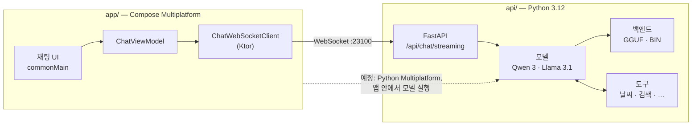

[English](../../README.md) | 한국어

<div align="center">


# Gemstone

**모든 플랫폼에 하나의 AI 채팅 클라이언트 — 모델을 내 기기에서 돌리기 위해 만들었습니다.**

[](../../LICENSE.md)
[](../../gradle/libs.versions.toml)
[](../../gradle/libs.versions.toml)
[](../../pyproject.toml)
[](#-현황)

[가이드](https://logitai.github.io/Gemstone/?lang=ko) ·
[빠른 시작](#-빠른-시작) ·
[아키텍처](#-아키텍처) ·
[현황](#-현황)

</div>

---

## 💎 왜 Gemstone 인가?

대부분의 AI 채팅 앱은 남의 서버를 들여다보는 얇은 창입니다. Gemstone 은 반대편에서 출발합니다:
**공개 가중치 모델을, 내가 있는 곳에서, 모든 기기에 들고 다닐 수 있는 하나의 인터페이스로.**

지금은 Android, iOS, 데스크톱, 웹을 위한 Kotlin
[Compose Multiplatform](https://www.jetbrains.com/compose-multiplatform/) 클라이언트가, 내 GPU 에서
직접 띄운 Python 서버와 대화하는 형태입니다. 다음 단계에서는 같은 Python 모델 코드가
[Python Multiplatform](https://github.com/thisisthepy/python-multiplatform) 을 통해 앱 *안으로*
들어가, 별도 서버도 네트워크도 없이 채팅할 수 있게 됩니다.

## ✨ 기능

- 🧩 **하나의 코드베이스, 네 개의 타깃** — Android, iOS, 데스크톱(Windows, macOS, Linux), 웹(Kotlin/Wasm) 이 UI, 뷰모델, 프로토콜을 공유합니다.
- 🚀 **스트리밍 채팅** — 토큰이 생성되는 즉시 WebSocket 으로 도착하고, 그 자리에서 Markdown 으로 렌더링됩니다.
- 🧠 **보이는 추론 과정** — 모델의 `<think>` 블록이 경과 시간과 함께 접을 수 있는 패널로 표시됩니다.
- 🔌 **도구 호출** — 날씨, 공휴일, 환율, 계산기, 웹 검색을 서버에서 병렬로 실행하고 결과를 모델에 돌려줍니다.
- 📦 **양자화된 공개 가중치 모델** — Qwen 3 14B 와 Llama 3.1 8B 를 4비트로, llama.cpp(GGUF) 또는 transformers + bitsandbytes 로 구동합니다.
- 🖥️ **네이티브 데스크톱 경험** — JetBrains Jewel 데코레이티드 윈도우와 Dmg / Msi / Deb 설치 파일.

## 🚀 빠른 시작

Git, Python 3.12, [uv](https://docs.astral.sh/uv/), JDK 21 이상이 필요합니다. 14B 모델에는 CUDA GPU 를
권장합니다.

**1. 저장소를 받고 서버 의존성 설치**

```bash
git clone https://github.com/LogitAI/Gemstone.git
cd Gemstone
uv sync
```

선택 — CUDA 를 쓰는 llama.cpp:

```bash
CMAKE_ARGS="-DGGML_CUDA=on -DLLAVA_BUILD=off -DCMAKE_CUDA_ARCHITECTURES=native" \
FORCE_CMAKE=1 uv pip install llama-cpp-python --no-cache-dir --force-reinstall --upgrade
```

**2. 모델 서버 실행** (포트 `23100`, 모델은 처음 쓸 때 내려받습니다)

```bash
python -m api run server
```

<http://127.0.0.1:23100/> 를 열면 서버에 함께 들어 있는 웹 클라이언트가 뜹니다.

**3. 네이티브 클라이언트 실행**

```bash
./gradlew :app:run           # 데스크톱
./gradlew :app:installDebug  # Android
```

**내 코드에서 서버와 대화하기** — 프레임 세 개를 보내면 토큰이 흘러나옵니다:

```python
import asyncio, json, urllib.request
import websockets  # Gemstone 의존성에 이미 포함

async def ask(prompt: str, host: str = "127.0.0.1:23100") -> None:
    req = urllib.request.Request(f"http://{host}/api/models/qwen3/sessions/", method="POST")
    session_id = json.load(urllib.request.urlopen(req))["session_id"]

    async with websockets.connect(f"ws://{host}/api/chat/streaming") as ws:
        await ws.send(json.dumps({"session_id": session_id}))  # 1. 세션
        await ws.send(json.dumps([]))                          # 2. 대화 기록
        await ws.send(prompt)                                  # 3. 프롬프트
        async for token in ws:
            if token == "<EOS>":
                break
            print(token, end="", flush=True)

asyncio.run(ask("오늘 대전 날씨가 어때?"))
```

브라우저 클라이언트 [`api/src/test/static/index.py`](../../api/src/test/static/index.py) 와 같은
프로토콜입니다.

## 🧩 아키텍처



| 디렉터리 | 들어 있는 것 |
|---|---|
| `app/src/commonMain` | UI, 뷰모델, 네트워크 프로토콜 — 모든 타깃이 공유 |
| `app/src/{android,ios,desktop,wasmJs}Main` | 플랫폼별 진입점 하나씩 |
| `app/src/cioMain` | Android, iOS, 데스크톱이 공유하는 Ktor CIO 엔진 |
| `api/src/main/models` | 모델 정의: 프롬프트, 샘플링 기본값, 지원 백엔드 |
| `api/src/main/backend` | 추론 런타임: llama.cpp(GGUF), transformers 4비트(BIN) |
| `api/src/main/utils` | 도구 구현과 도구 호출 루프 |

## 📍 현황

Gemstone 은 초기 단계의, 동작하는 프로토타입입니다. 각 부분의 솔직한 상태:

| 영역 | 상태 |
|---|---|
| 스트리밍 채팅, 추론 표시, 도구 호출 | ✅ 동작 |
| Android, 데스크톱, 웹 클라이언트 | ✅ 동작 |
| iOS 클라이언트 | 🟡 프레임워크 타깃은 구성됨, Xcode 빌드 스크립트 수정 필요 |
| 클라이언트의 모델 선택 | 🟡 하드코딩된 목록, 아직 서버에서 읽지 않음 |
| 대화 기록 | 🟡 메모리에만 보관 |
| 설정 화면 | ⏳ 예정 |
| Python Multiplatform 을 통한 온디바이스 추론 | ⏳ 예정 |
| 오프라인 모드, 기기 간 동기화 | ⏳ 예정 |
| OpenAI 호환 API | ⏳ 예정 |
| 네이티브 데스크톱 실행 파일 (GraalVM, JVM 없음) | ⏳ 진행 중 |
| 자동화된 테스트 | ⏳ 아직 없음 — 최우선 과제 |

## 📖 문서

- **[Gemstone 가이드](https://logitai.github.io/Gemstone/?lang=ko)** — 시작하기, 개념, 작업별 가이드, FAQ (한국어 · English). 소스는 [`docs/guide/`](../guide/).
- **[English README](../../README.md)**

## 🌐 생태계

Gemstone 은 아직 아래 프로젝트에 의존하지 않습니다. 이것은 [thisisthepy](https://github.com/thisisthepy)
의 "모든 플랫폼 위의 Python" 스택이 실어 나르려는 애플리케이션입니다:

| 프로젝트 | 역할 |
|---|---|
| [python-multiplatform](https://github.com/thisisthepy/python-multiplatform) | Kotlin Multiplatform 에 임베딩한 CPython — 온디바이스 추론으로 가는 길 |
| [pythonx-compose](https://github.com/thisisthepy/pythonx-compose) | Compose Multiplatform 의 Python 래퍼 |
| [toolchain](https://github.com/thisisthepy/toolchain) | Python Multiplatform 용 Gradle 빌드 플러그인과 도구 |
| [torchnative](https://github.com/thisisthepy/torchnative) | 기기 위에서 그대로 도는 실제 PyTorch 생태계 |

## 🤝 기여하기

이슈와 풀 리퀘스트는 [LogitAI/Gemstone](https://github.com/LogitAI/Gemstone/issues) 에서 환영합니다.
Gemstone 은 의도 우선, 테스트 우선으로 개발합니다 — 풀 리퀘스트를 열기 전에
[가이드의 기여 안내](https://logitai.github.io/Gemstone/faq.html?lang=ko#contributing) 를 읽어 주세요.

## 🙏 감사의 말

Kotlin, Compose Multiplatform, Jewel 을 만든 [JetBrains](https://www.jetbrains.com/) ·
[llama.cpp](https://github.com/ggml-org/llama.cpp) 와
[llama-cpp-python](https://github.com/abetlen/llama-cpp-python) ·
[Hugging Face](https://huggingface.co/) Transformers ·
[Qwen](https://github.com/QwenLM) 과 [Llama](https://www.llama.com/) 모델 팀 ·
무료 공개 API 를 제공하는 [Open-Meteo](https://open-meteo.com/) 와 [Nager.Date](https://date.nager.at/).

## 📄 라이선스

[MIT](../../LICENSE.md) © 2025 thisisthepy
